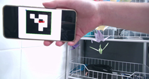
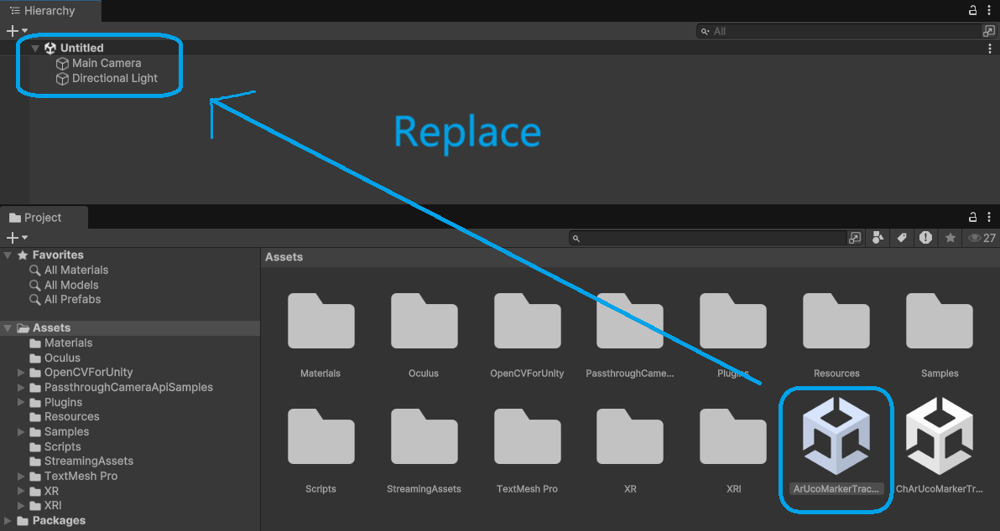

# Unity Play Mode Quest ArUco Marker Tracking

This repository is forked from [TakashiYoshinaga/QuestArUcoMarkerTracking](https://github.com/TakashiYoshinaga/QuestArUcoMarkerTracking). The original repository enables single and multi-marker detection and tracking using OpenCV with the Passthrough Camera API for Meta Quest 3/3S. It provides sample scenes that support both ArUco(Single/Multi) and ChArUco(Single) markers for augmented reality applications on Quest devices. You can check original repository for more details.

I modified the project to support **single marker detection and tracking** using OpenCV with the **Computer Camera** for Meta Quest 3/3S.   
  
For a demonstration, check out the following video:

-  Single Marker Tracking Demo (ArUco) - [Link](https://drive.google.com/file/d/153V5RZAuz3pqiAaiqv4zdsn7fD0gHWuS/view?usp=sharing)

    

---

## Dependencies

⚠ **Important Notice**  
When opening the project for the first time, you will likely encounter errors. This is because **OpenCV for Unity** is not yet installed.  
**Please ignore the errors initially, proceed to open the project, and install OpenCV for Unity manually.**

This project uses **OpenCV for Unity**.  
Please purchase and install it from the Unity Asset Store:  
[OpenCV for Unity](https://assetstore.unity.com/packages/tools/integration/opencv-for-unity-21088?locale=en-US)

Tested with **OpenCV for Unity v2.6.5**.

---

## Usage

### Marker Preparation
To use this project, please download and install the required marker files from the following links:

- **ArUco Markers**: [ArUcoMarker.pdf](https://github.com/TakashiYoshinaga/QuestArUcoMarkerTracking/blob/main/ArUcoMarker.pdf)  

### Unity Scenes

- **ArUco Marker Tracking (Single & Multi)**: `ArUcoMarkerTracking.unity`  
- When you first open the project, Unity loads a default untitled scene. To proceed, switch to the ArUco scene in the Hierarchy and delete the untitled scene.

  

### Default Settings

#### ArUco Marker
- Marker Dictionary: **DICT_4X4_50**
- Marker Size: **0.1m**  
Feel free to modify these settings to suit your needs.

## Reference Repositories

This implementation is based on the following sample repositories:

- [Unity-PassthroughCameraApiSamples](https://github.com/oculus-samples/Unity-PassthroughCameraApiSamples)
- [QuestCameraKit](https://github.com/xrdevrob/QuestCameraKit)

---

## Contact

If you have any questions, feel free to reach out:
 
- **LinkedIn**: [Oscar Zhang](https://www.linkedin.com/in/oscar-z-cw337)  
